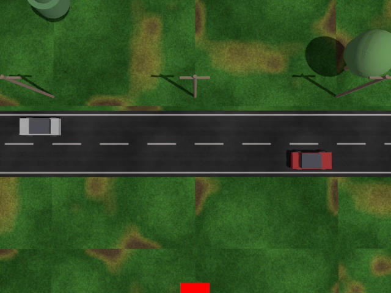

# ardupilot_gazebo_ai

Gazebo worlds for flying an ArduPilot drone with an LLM agent. The point is the camera: a
world worth looking at, so that when an agent asks the drone for a photo it gets back
something with roads, cars, buildings and markers in it instead of an empty grey plane.

Built for [mavlink-mcp](https://github.com/deepak61296/mavlink-mcp), but it is just a
Gazebo world — anything that speaks MAVLink can use it.



That frame came off the drone's camera through mavlink-mcp, mid-flight, with no editing.

Everything here is local except the walking person's animated mesh, which Gazebo pulls from
Fuel once and then caches — so the sim starts offline and does not stall halfway through
loading (on a first run with no network the person is simply invisible; nothing else is affected).

## Status

**Stable** — the static field (grass, trees, buildings, roads, marker, pad, boxes) and the
walking person: flown and photographed through mavlink-mcp, and the person detects reliably in
the sim (YOLOX ~0.87 from an oblique view).

**Working, rough edges** — the moving red car laps correctly, but as a box composite it is weak
for object detection at range (reads as truck/bench); a real car mesh is the fix.

**Future** — a proper car mesh for the dynamic-chase demo, and more animated actors.

## What's in it

`worlds/iris_field_vision.sdf` — a 1 km field: 144 grass tiles, 40 trees, 15 buildings,
3 marked roads, 10 static cars, 2 radio towers, 7 poles, 2 walls and a pond, over a far-field
plane so the horizon isn't a flat colour. Targets to find: an ArUco marker, a landing pad and
coloured boxes. **Moving** targets for the follow demos: a person walking a 14 m line (COCO's
strongest class — a real animated mesh) and a red car lapping a 10 m circle (driven by Gazebo's
`VelocityControl`, no external publisher). The radio tower 30 m east of spawn is there on purpose
as an obstacle for avoidance work.

`worlds/camera_test.sdf` — a bare world for checking the video path works.

The world is generated: edit `scripts/gen_field_world.py`, not the SDF. Textures come from
`scripts/gen_textures.py` (procedural, tileable by construction — no image files to ship).

## Setup

You need Gazebo Harmonic, ArduPilot SITL, and ArduPilot's Gazebo plugin.

```bash
git clone git@github.com:deepak61296/ardupilot_gazebo_ai.git
cd ardupilot_gazebo_ai
bash scripts/setup_plugin.sh     # clones + builds ardupilot_gazebo, patches its camera
bash scripts/sim_up.sh --check   # tells you what's still missing
```

`setup_plugin.sh` does not vendor the plugin — it clones upstream. That keeps this repo
small and MIT, and lets you pull ArduPilot's fixes normally.

## Run

```bash
bash scripts/sim_up.sh                              # terminal 1: Gazebo + SITL
mavlink-mcp --enable-actuation --camera gazebo      # terminal 2
```

Then ask the agent to take off, point the camera down, fly north and describe what it sees.

`sim_up.sh` auto-detects the gz binary, the NVIDIA EGL vendor file and your X display, and
starts the Gazebo **server and GUI as separate processes** — a combined `gz sim -r` renders
the GUI view but not the camera sensor, which is a confusing way to get black frames.

## The camera

The stock `gimbal_small_3d` has a 2.0 rad (~114°) FOV and a `CameraZoomPlugin` that
re-applies its own FOV to the rendered stream at startup, silently overriding the SDF. The
rendered image then disagrees with `camera_info`, and anything that geo-tags what it sees
lands ~2.2× short. `scripts/patch_sim_camera.sh` narrows the FOV to 1.2 rad, removes the
zoom plugin, and publishes the gimbal joint states so you can read the mount's real angle
instead of the angle it was told to go to. It is idempotent and `sim_up.sh` re-applies it
every launch.

Video is H.264 on `udp://127.0.0.1:5600`. Gazebo does not stream until something asks it
to; `sim_up.sh` publishes the enable topic for you.

To read that stream in Python you need OpenCV built with GStreamer. The `opencv-python`
wheel is not (`GStreamer: NO`), so use Ubuntu's `python3-opencv` — and pin `numpy<2` with
it, since that build is compiled against NumPy 1.x.

## Gotchas

- The Gazebo world frame is ENU: **north is +Y**, not +X. A model at `15 0 0` is 15 m east.
- One `gz sim` at a time. The plugin binds UDP 9002, so a stray server silently steals the
  connection and your drone won't move. Kill with `pkill -9 -f 'gz[ ]sim'` — the bracket
  stops the pattern matching the shell you typed it into.
- Start `gz sim` from a clean environment. ROS or conda on the path makes the plugin fail
  to load with a Qt symbol error. The scripts here use `env -i`.
- The world is named `iris_runway` even though it is a field. That keeps the camera topic
  path stable for tools that hardcode it; renaming it means updating those too.
- `PreArm: Motors: Check frame class and type` means SITL's eeprom lost `FRAME_CLASS`. Run
  it once with `-w` to reload the `gazebo-iris` parameters.

## License

MIT. ArduPilot's plugin and models are LGPL-3.0 and are **not** included here — they are
cloned from upstream by `scripts/setup_plugin.sh`.
